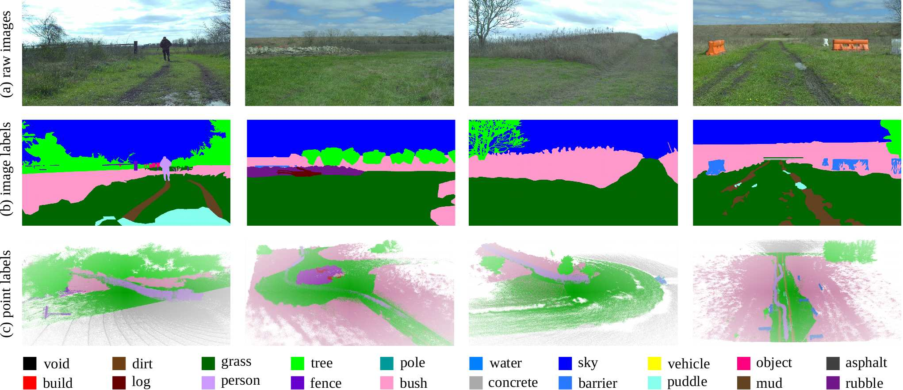
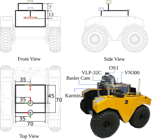
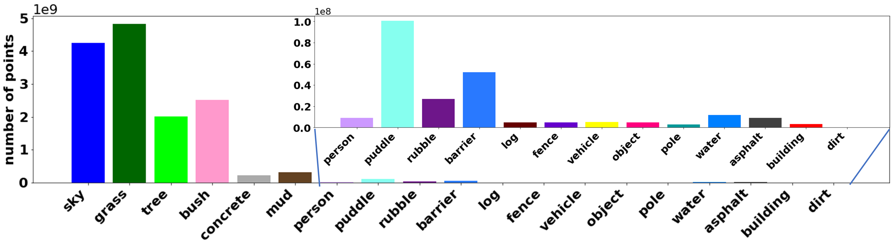
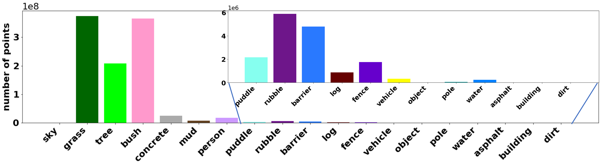
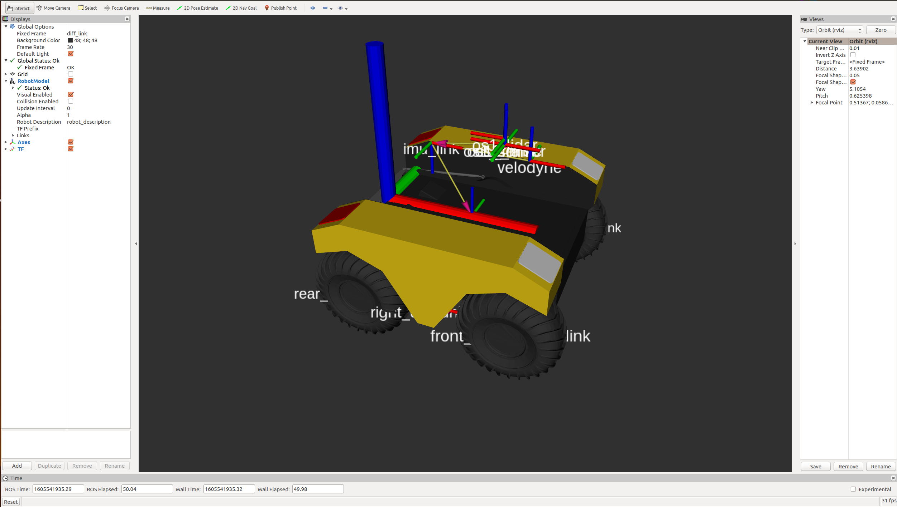

<h1>RELLIS-3D: A Multi-modal Dataset for Off-Road Robotics</h1>
<p align="center">
<a href="https://www.tamu.edu/"></a>&emsp;&emsp;&emsp;&emsp;<a href="https://www.arl.army.mil/"></a></p>
<p align="center">
Peng Jiang<sup>1</sup>, Philip Osteen<sup>2</sup>, Maggie Wigness<sup>2</sup> and Srikanth Saripalli<sup>1</sup><br>
1. <a href="https://www.tamu.edu/">Texas A&M University; </a>&emsp;2. <a href="https://www.arl.army.mil/">CCDC Army Research Laboratory</a><br>
<a href="https://unmannedlab.github.io/research/RELLIS-3D">[Website]</a> <a href="https://arxiv.org/abs/2011.12954">[Paper]</a> <a href="https://github.com/unmannedlab/RELLIS-3D">[Github]</a> 
</p>

## Overview
Semantic scene understanding is crucial for robust and safe autonomous navigation, particularly so in off-road environments. Recent deep learning advances for 3D semantic segmentation rely heavily on large sets of training data; however, existing autonomy datasets represent urban environments or lack multimodal off-road data. We fill this gap with RELLIS-3D, a multimodal dataset collected in an off-road environment containing annotations for **13,556 LiDAR scans** and **6,235 images**. The data was collected on the Rellis Campus of Texas A\&M University and presents challenges to existing algorithms related to class imbalance and environmental topography. Additionally, we evaluate the current state of the art deep learning semantic segmentation models on this dataset. Experimental results show that RELLIS-3D presents challenges for algorithms designed for segmentation in urban environments. Except for the annotated data, the dataset also provides full-stack sensor data in ROS bag format, including **RGB camera images**, **LiDAR point clouds**, **a pair of stereo images**, **high-precision GPS measurement**, and **IMU data**. This novel dataset provides the resources needed by researchers to develop more advanced algorithms and investigate new research directions to enhance autonomous navigation in off-road environments.



### Recording Platform
* [Clearpath Robobtics Warthog](https://clearpathrobotics.com/warthog-unmanned-ground-vehicle-robot/)

### Sensor Setup
* 64 channels Lidar: [Ouster OS1](https://ouster.com/products/os1-lidar-sensor)
* 32 Channels Lidar: [Velodyne Ultra Puck](https://velodynelidar.com/vlp-32c.html)
* 3D Stereo Camera: [Nerian Karmin2](https://nerian.com/products/karmin2-3d-stereo-camera/) + [Nerian SceneScan](https://nerian.com/products/scenescan-stereo-vision/)
* RGB Camera: [Basler acA1920-50gc](https://www.baslerweb.com/en/products/cameras/area-scan-cameras/ace/aca1920-50gc/) + [Edmund Optics 16mm/F1.8 86-571](https://www.edmundoptics.com/p/16mm-focal-length-hp-series-fixed-focal-length-lens/28990/)
* Inertial Navigation System (GPS/IMU): [Vectornav VN-300 Dual Antenna GNSS/INS](https://www.vectornav.com/products/vn-300)



## Annotated Data:
### Ontology:
With the goal of providing multi-modal data to enhance autonomous off-road navigation, we defined an ontology of object and terrain classes, which largely derives from [the RUGD dataset](http://rugd.vision/) but also includes unique terrain and object classes not present in RUGD. Specifically, sequences from this dataset includes classes such as mud, man-made barriers, and rubble piles. Additionally, this dataset provides a finer-grained class structure for water sources, i.e., puddle and deep water, as these two classes present different traversability scenarios for most robotic platforms. Overall, 20 classes (including void class) are present in the data.

**Ontology Definition** ([Download 18KB](https://drive.google.com/file/d/1K8Zf0ju_xI5lnx3NTDLJpVTs59wmGPI6/view?usp=sharing))

### Images Statics:



### Image Download: 

**Image with Annotation Examples** ([Download 3MB](https://drive.google.com/file/d/1wIig-LCie571DnK72p2zNAYYWeclEz1D/view?usp=sharing))

**Full Images** ([Download 11GB](https://drive.google.com/file/d/1F3Leu0H_m6aPVpZITragfreO_SGtL2yV/view?usp=sharing))

**Full Image Annotations Color Format** ([Download 119MB](https://drive.google.com/file/d/1HJl8Fi5nAjOr41DPUFmkeKWtDXhCZDke/view?usp=sharing))

**Full Image Annotations ID Format** ([Download 94MB](https://drive.google.com/file/d/16URBUQn_VOGvUqfms-0I8HHKMtjPHsu5/view?usp=sharing))

**Image Split File** ([44KB](https://drive.google.com/file/d/1zHmnVaItcYJAWat3Yti1W_5Nfux194WQ/view?usp=sharing))

### LiDAR Scans Statics:



### LiDAR Download: 

**LiDAR with Annotation Examples** ([Download 24MB](https://drive.google.com/file/d/1QikPnpmxneyCuwefr6m50fBOSB2ny4LC/view?usp=sharing)) 

**LiDAR with Color Annotation PLY Format** ([Download 26GB](https://drive.google.com/file/d/1BZWrPOeLhbVItdN0xhzolfsABr6ymsRr/view?usp=sharing))

The header of the PLY file is described as followed:
```
element vertex
property float x
property float y
property float z
property float intensity
property uint t
property ushort reflectivity
property uchar ring
property ushort noise
property uint range
property uchar label
property uchar red
property uchar green
property uchar blue
```
To visualize the color of the ply file, please use [CloudCompare](https://www.danielgm.net/cc/) or [Open3D](http://www.open3d.org/). Meshlab has problem to visualize the color.


**LiDAR SemanticKITTI Format** ([Download 14GB](https://drive.google.com/file/d/1lDSVRf_kZrD0zHHMsKJ0V1GN9QATR4wH/view?usp=sharing))

To visualize the datasets using the SemanticKITTI tools, please use this fork: [https://github.com/unmannedlab/point_labeler](https://github.com/unmannedlab/point_labeler)

**LiDAR Annotation SemanticKITTI Format** ([Download 174MB](https://drive.google.com/file/d/1LUmmO2imJ4m5uCtGv1FYusCo-bEPDbBx/view?usp=sharing))

**LiDAR Scan Poses files** ([Download 174MB](https://drive.google.com/file/d/1cyVqJEnlzO9ANOP7hU8GJk28ckPDUSGv/view?usp=sharing))

**LiDAR Split File** ([75KB](https://drive.google.com/file/d/1raQJPySyqDaHpc53KPnJVl3Bln6HlcVS/view?usp=sharing)) 

### Calibration Download: 
**Camera Instrinsic** ([Download 2KB](https://drive.google.com/file/d/1NAigZTJYocRSOTfgFBddZYnDsI_CSpwK/view?usp=sharing))

**Camera to LiDAR** ([Download 3KB](https://drive.google.com/file/d/1Xra1E8Bc4l5VwjjNm7o41nDFO29nmx-u/view?usp=sharing))

## Benchmarks

### Image Semantic Segmenation 
models | sky | grass |tr ee | bush | concrete | mud | person | puddle | rubble | barrier | log | fence | vehicle | object | pole | water | asphalt | building | mean
-------| ----| ------|------|------|----------|-----| -------| -------|--------|---------|-----|-------| --------| -------|------|-------|---------|----------| ----
[HRNet+OCR](https://github.com/HRNet/HRNet-Semantic-Segmentation/tree/HRNet-OCR) | 96.94 | 90.20 | 80.53 | 76.76 | 84.22 | 43.29 | 89.48 | 73.94 | 62.03 | 54.86 | 0.00 | 39.52 | 41.54 | 46.44 | 9.51 | 0.72 | 33.25 | 4.60  | 48.83
[GSCNN](https://github.com/nv-tlabs/GSCNN) | 97.02 | 84.95 | 78.52 | 70.33 | 83.82 | 45.52 | 90.31 | 71.49 | 66.03 | 55.12 | 2.92 | 41.86 | 46.51 | 54.64 | 6.90 | 0.94 | 44.18 | 11.47  | 50.13

[](https://www.youtube.com/watch?v=vr3g6lCTKRM)

### LiDAR Semantic Segmenation
models | sky | grass |tr ee | bush | concrete | mud | person | puddle | rubble | barrier | log | fence | vehicle | object | pole | water | asphalt | building | mean
-------| ----| ------|------|------|----------|-----| -------| -------|--------|---------|-----|-------| --------| -------|------|-------|---------|----------| ----
[SalsaNext](https://github.com/Halmstad-University/SalsaNext) | - |  64.74 | 79.04 | 72.90 | 75.27 | 9.58 | 83.17 | 23.20 | 5.01 | 75.89 | 18.76 | 16.13| 23.12 | -  | 56.26 | 0.00 | - | -   | 40.20 
[KPConv](https://github.com/HuguesTHOMAS/KPConv) | - | 56.41 | 49.25 | 58.45 | 33.91 | 0.00 | 81.20 | 0.00 | 0.00 | 0.00 | 0.00 | 0.40 | 0.00 | - | 0.00 | 0.00 | - | -   | 18.64

[](https://www.youtube.com/watch?v=wkm8UiVNGao)

### Benchmark Reproduction

To reproduce the results, please refer to [here](./benchmarks/README.md)

## ROS Bag Raw Data

Data included in raw ROS bagfiles:

Topic Name | Message Tpye | Message Descriptison
------------ | ------------- | ---------------------------------
/img_node/intensity_image | sensor_msgs/Image | Intensity image generated by ouster Lidar
/img_node/noise_image | sensor_msgs/Image | Noise image generated by ouster Lidar
/img_node/range_image | sensor_msgs/Image | Range image generated by ouster Lidar
/imu/data | sensor_msgs/Imu | Filtered imu data from embeded imu of Warthog
/imu/data_raw | sensor_msgs/Imu |  Raw imu data from embeded imu of Warthog
/imu/mag | sensor_msgs/MagneticField | Raw magnetic field data from embeded imu of Warthog
/nerian_stereo/left_image | sensor_msgs/Image | Left image from Nerian Karmin2 
/nerian_stereo/right_image | sensor_msgs/Image | Right image from Nerian Karmin2 
/odometry/filtered | nav_msgs/Odometry | A filtered local-ization estimate based on wheel odometry (en-coders) and integrated IMU from Warthog
/os1_cloud_node/imu | sensor_msgs/Imu | Raw imu data from embeded imu of Ouster Lidar
/os1_cloud_node/points | sensor_msgs/PointCloud2 | Point cloud data from Ouster Lidar
/os1_node/imu_packets | ouster_ros/PacketMsg | Raw imu data from Ouster Lidar
/os1_node/lidar_packets | ouster_ros/PacketMsg | Raw lidar data from Ouster Lidar
/vectornav/GPS | sensor_msgs/NavSatFix | INS data from VectorNav-VN300
/vectornav/IMU | sensor_msgs/Imu | Imu data from VectorNav-VN300
/vectornav/Mag | sensor_msgs/MagneticField | Raw magnetic field data from VectorNav-VN300
/vectornav/Odom | nav_msgs/Odometry | Odometry from VectorNav-VN300
/vectornav/Pres | sensor_msgs/FluidPressure |
/vectornav/Temp | sensor_msgs/Temperature |
/velodyne_points | sensor_msgs/PointCloud2 | PointCloud produced by the Velodyne Lidar

### ROS Bag Download

**ROS Bag Examples** ([2GB](https://drive.google.com/file/d/163pEtjMhcM1OJo36ZOi6_zDHpuPSL8us/view?usp=sharing))

**Sequence 00000**: Synced data: ([12GB](https://drive.google.com/file/d/10dHPMCschg1dMeb_Y6pcPvC-HZQZ8_ek/view?usp=sharing)) Filtered data: ([23GB](https://drive.google.com/file/d/1d-t4P1idWkfxDEkodBrsbd4B2nAc8rZ3/view?usp=sharing)) Full-stack Raw data: ([29GB](https://drive.google.com/drive/folders/1IZ-Tn_kzkp82mNbOL_4sNAniunD7tsYU?usp=sharing))

[](https://www.youtube.com/watch?v=Qc7IepWGKr8)

**Sequence 00001**: Synced data: ([8GB](https://drive.google.com/file/d/1I98lEog0xFFAVVZ_AEBvXzIEcFQ2bGRl/view?usp=sharing)) Filtered data: ([16GB](https://drive.google.com/file/d/1LogHRN1ElE2xryILMPU3OtnV6VCnjs52/view?usp=sharing)) Full-stack Raw data: ([22GB](https://drive.google.com/drive/folders/1hf-vF5zyTKcCLqIiddIGdemzKT742T1t?usp=sharing))

[](https://www.youtube.com/watch?v=nO5JADjDWQ0)

**Sequence 00002**: Synced data: ([14GB](https://drive.google.com/file/d/1yhohyWOIIf00YLUZ1RT7ouq3B-iaOU91/view?usp=sharing)) Filtered data: ([28GB](https://drive.google.com/file/d/1F_8yviLHcAVmBpWEyCITFd1nRgPRmkVX/view?usp=sharing)) Full-stack Raw data: ([37GB](https://drive.google.com/drive/folders/1R8jP5Qo7Z6uKPoG9XUvFCStwJu6rtliu?usp=sharing))

[](https://www.youtube.com/watch?v=aXaOmzjHmNE)

**Sequence 00003**:Synced data: ([8GB](https://drive.google.com/file/d/1poY5eaKKhmjUQpF1rsoL4mm4wO7T8CJM/view?usp=sharing)) Filtered data: ([15GB](https://drive.google.com/file/d/1HDbtqaYhfeyLoq9UsxOhgCJl2urGVKUc/view?usp=sharing)) Full-stack Raw data: ([19GB](https://drive.google.com/drive/folders/1iP0k6dbmPdAH9kkxs6ugi6-JbrkGhm5o?usp=sharing))


[](https://www.youtube.com/watch?v=Kjo3tGDSbtU)

**Sequence 00004**:Synced data: ([7GB](https://drive.google.com/file/d/1xLvai6rorpjxRZXraZK7qPsA1vYMkTHJ/view?usp=sharing)) Filtered data: ([14GB](https://drive.google.com/file/d/1usxAjxHrw89R6rMA0GtmYQRtzIP-QGJF/view?usp=sharing)) Full-stack Raw data: ([17GB](https://drive.google.com/drive/folders/1WV9pecF2beESyM7N29W-nhi-JaoKvEqc?usp=sharing))


[](https://www.youtube.com/watch?v=lLLYTI4TCD4)

### ROS Environment Installment
The ROS workspace includes a plaftform description package which can provide rough tf tree for running the rosbag.



## Full Data Download:
[Access Link](https://drive.google.com/drive/folders/1aZ1tJ3YYcWuL3oWKnrTIC5gq46zx1bMc?usp=sharing)

## Citation
```
@misc{jiang2020rellis3d,
      title={RELLIS-3D Dataset: Data, Benchmarks and Analysis}, 
      author={Peng Jiang and Philip Osteen and Maggie Wigness and Srikanth Saripalli},
      year={2020},
      eprint={2011.12954},
      archivePrefix={arXiv},
      primaryClass={cs.CV}
}
```

## Collaborator
<a href="https://www.arl.army.mil/"></a>

## License
All datasets and code on this page are copyright by us and published under the Creative Commons Attribution-NonCommercial-ShareAlike 3.0 License. 

## Updates
* 11/26/2020 v1.0 release

## Related Work

[SemanticUSL: A Dataset for Semantic Segmentation Domain Adatpation](https://unmannedlab.github.io/research/SemanticUSL)

[LiDARNet: A Boundary-Aware Domain Adaptation Model for Lidar Point Cloud Semantic Segmentation](https://unmannedlab.github.io/research/LiDARNet)
